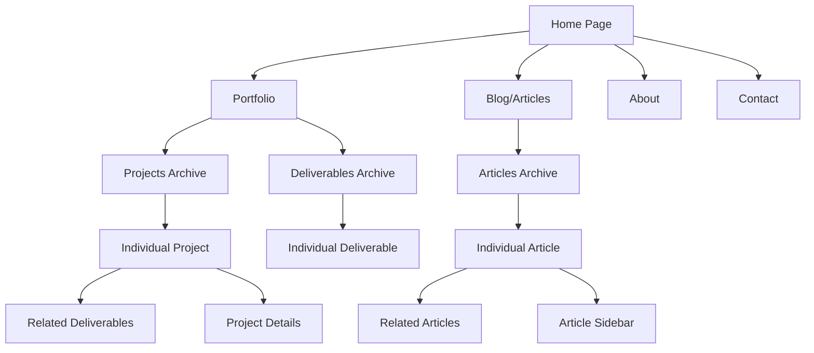
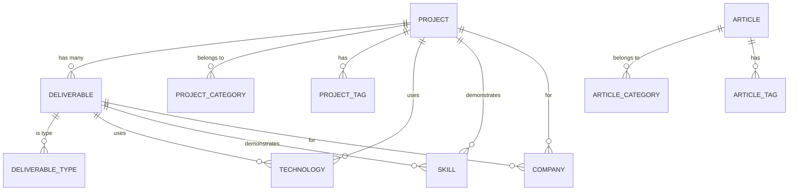

# Ethan Ede Website Information Architecture

## Site Map Diagram



## Content Model



## Hierarchical Structure

### Primary Navigation
- **Home**
- **Portfolio**
  - Projects
    - By Category
    - By Technology
    - By Company
  - Deliverables
    - By Type
    - By Technology
- **Blog**
  - Articles
    - By Category
    - By Tag
- **About**
- **Contact**

### Content Relationships
1. **Projects** (Parent)
   - Can have multiple deliverables
   - Organized by categories
   - Tagged with technologies and skills
   
2. **Deliverables** (Child of Projects)
   - Belong to a project
   - Have specific types (e.g., Design, Development)
   - Share taxonomies with projects

3. **Articles** (Independent)
   - Standalone blog content
   - Own categorization system
   - Related articles sidebar

## User Flows

### Portfolio Exploration Flow
```
Home → Portfolio → Project Category → Individual Project → Related Deliverables
```

### Content Discovery Flow
```
Home → Blog → Article Category → Individual Article → Related Articles
```

### Technology-Based Navigation
```
Any Page → Technology Tag → All Projects/Deliverables using that technology
```

## Key Features
- **Cross-linking**: Projects and deliverables are interconnected
- **Multiple taxonomies**: Content can be discovered through various paths
- **Contextual navigation**: Related content in sidebars
- **Persistent CTA**: Contact call-to-action across pages

## SEO & URL Structure
- `/projects/` - Projects archive
- `/projects/[project-slug]/` - Individual project
- `/deliverables/` - Deliverables archive  
- `/deliverables/[deliverable-slug]/` - Individual deliverable
- `/blog/` - Articles archive
- `/blog/[article-slug]/` - Individual article
- `/project-category/[category]/` - Category archives
- `/technology/[tech]/` - Technology archives